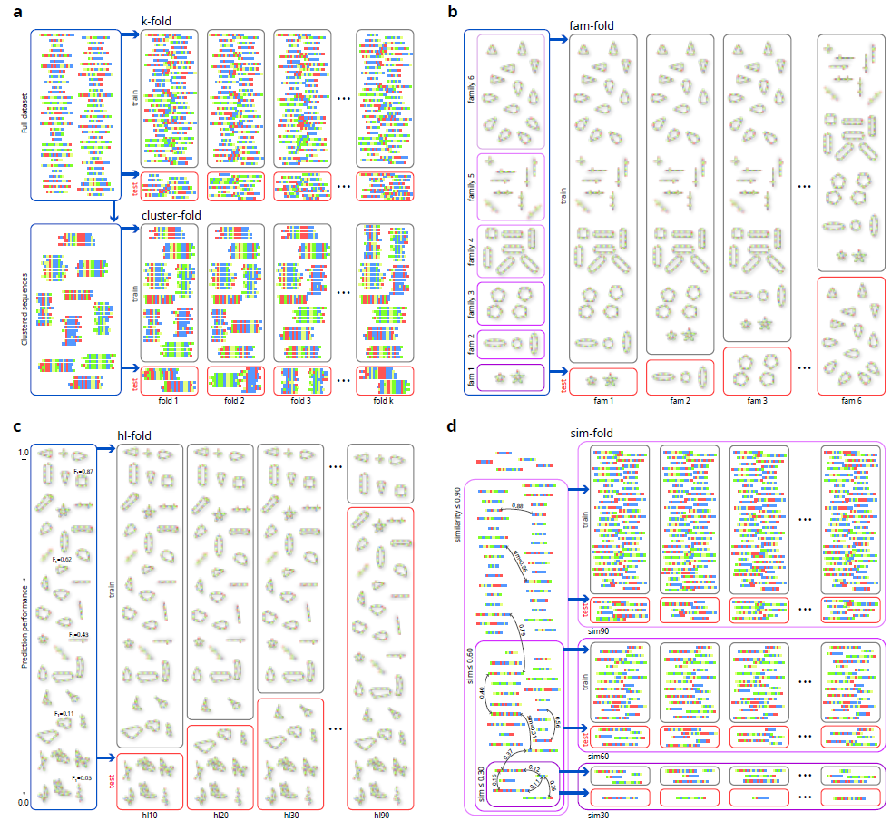

# Revisiting homology-aware cross validations for RNA secondary structure prediction

This repository contains the data and source code for the manuscript *Homology-aware cross-validation strategies for generalization assessment in RNA structure prediction*, by L.A. Bugnon, G. Kulemeyer, M. Gerard, L. Di Persia, G. Stegmayer and D.H. Milone, 2026 (under review). Research Institute for Signals, Systems and Computational Intelligence, [sinc(i)](https://sinc.unl.edu.ar/).

In this work we revise existing cross-validation strategies for RNA secondary structure prediction: random k-fold, clustering fold and family fold. 

We explain and analyze in detail the advantages and disadvantages of each one of them, additionally proposing two novel evaluation methodologies for testing: human-learned fold and similarity fold. 

All validation strategies are applied to state-of-the-art methods for RNA secondary structure prediction and comparative results are analyzed.

## Cross-validation methodologies for RNA secondary structure prediction revised

**a)** Random k-fold (top): the complete dataset of RNA sequences is randomly divided by k groups, at each fold a group is used for testing (red) and the rest for training partitions (gray). In cluster-fold (bottom), the complete dataset is split into clusters of similar sequences, for each fold a subset of these clusters is assigned to the training set, and the rest goes to the testing partition. 

**b)** fam-fold: the illustration has 6 structural families (triangles, lines, ovals, etc.). At each fold, one complete family is left out and used only for testing, while all the other families are used for training.

**c)** hl-fold: each fold has in the training set all the sequences for which RNAfold obtained an F1>threshold, and the rest of the sequences are used for testing. Several thresholds are defined to build the folds. 

**d)** sim-fold: several groups of increasing sequence similarity are built; then, inside each group of controlled similarity, many random train/test folds can be sampled.

### Distribution of structural distances
[This notebook](https://colab.research.google.com/github/sinc-lab/revisiting_crossval_rnafolding/blob/main/src/Figure_1_Distance_distributions.ipynb) reproduces the analysis of the distributions of testing to training structural distances for the different cross-validation strategies analyzed.

### Performance comparison on RNA folding
[This notebook](https://colab.research.google.com/github/sinc-lab/revisiting_crossval_rnafolding/blob/main/src/Figure_2_and_4_Methods_performance_comparisons.ipynb) shows the performance comparison among different cross-validation strategies that can be found in literature

 Performance comparison among existing cross-validation strategies. A) random $k$-fold; B) clustering fold; C) fam-fold. 

 Performance comparison of mean performance with 95% confidence interval in A) human learned fold; B) similarity fold.
   

[This notebook](https://colab.research.google.com/github/sinc-lab/revisiting_crossval_rnafolding/blob/main/src/Figure_3_Distribution_canonical_connections_distances.ipynb) reproduces the comparison of distribution of canonical connections (GC, AU and GU) in 3 folds of the family fold.

