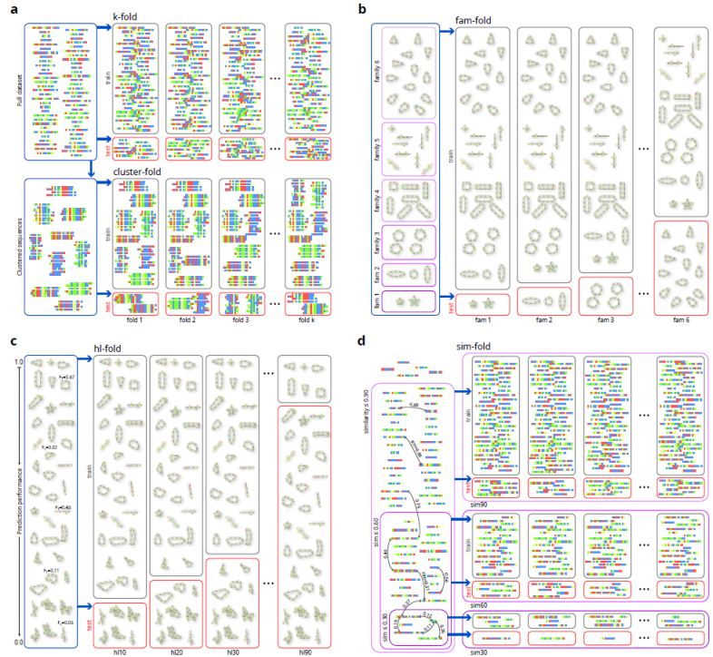
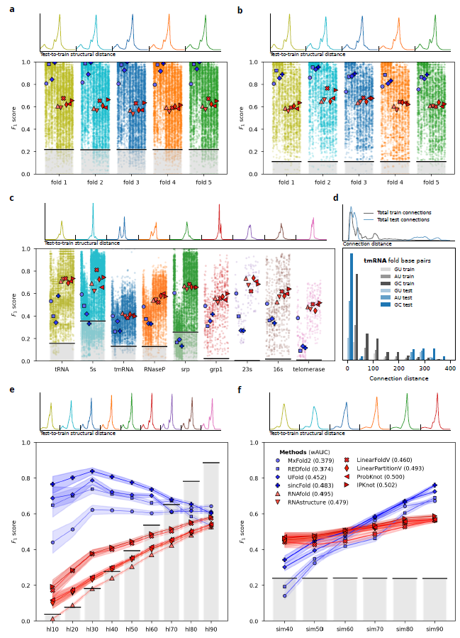

# Homology-aware cross-validation strategies for generalization assessment in RNA structure prediction

This repository contains the data and source code for the manuscript *Homology-aware cross-validation strategies for generalization assessment in RNA structure prediction*, by L.A. Bugnon, G. Kulemeyer, M. Gerard, L. Di Persia, G. Stegmayer and D.H. Milone, 2026 (under review). Research Institute for Signals, Systems and Computational Intelligence, [sinc(i)](https://sinc.unl.edu.ar/).

In this work we revise existing cross-validation strategies for RNA secondary structure prediction: random k-fold, clustering fold and family fold. 

We explain and analyze in detail the advantages and disadvantages of each one of them, additionally proposing two novel evaluation methodologies for testing: human-learned fold and similarity fold. 

All validation strategies are applied to state-of-the-art methods for RNA secondary structure prediction and comparative results are analyzed.

## Cross-validation methodologies for RNA secondary structure prediction revised

  
  

**a) random k-fold**: (top) the complete dataset is randomly divided into k groups, in a fold a group is used for testing (red) and the rest for training (gray). In **cluster-fold** (bottom), the complete dataset is split into clusters of similar sequences, in a fold a subset of them is assigned to the training set, and the rest is used for testing. 

**b) fam-fold**: the illustration has 6 structural families (triangles, lines, etc.). At each fold, one complete family is left out and used only for testing, while all the others are used for training.

**c) hl-fold**: each fold, in training, has all the sequences for which RNAfold obtained an F1>threshold, and the rest of the sequences are used for testing. Several thresholds define the folds. 

**d) sim-fold**: groups of increasing sequence simlarity are built, then inside each group many random train/test folds can be sampled.

## Performance comparison for RNA secondary structure prediction methods according to different cross-validation strategies

  
  
  

**a) k-fold**: (top) distribution of test-to-train structural distances of each fold; (bottom) median F1 for each prediction method indicated with a different marker (DL prediction methods in blue, classical prediction methods in red). Gray bars show the proportion of test to train sequences in each fold. 

**b) cluster-fold**: (top) test-to-train distance distributions; (bottom) structure prediction performance. 

**c) fam-fold**: (top) test-to-train distance distributions; (bottom) structure prediction performance. 

**d)** detailed analysis of connection distances for tmRNA family used in test set of fam-fold strategy: (top) distribution of distances between bases of canonical pairs in the reference structures of training (gray) and testing (blue) partitions, (bottom) distribution of connection distances distribution for canonical base pairs GU, AU and GC. 

**e) hl-fold**: (top) test to train distance distributions; (bottom) median F1 performance for each prediction method, with the 95% confidence interval shaded behind each trend line. 

**f) sim-fold**: (top) test-to-train distance distributions; (bottom) structure prediction performance. wAUC: area under the performance curve for each method, weighted by the difficulty of the partition.

[This notebook](https://colab.research.google.com/github/sinc-lab/xvalRNAfolding/blob/main/src/Figure_2_dist_dist_git.ipynb) shows the train-to-test structural distance distributions of each cross-validation strategy.

[This notebook](https://colab.research.google.com/github/sinc-lab/xvalRNAfolding/blob/main/src/Figure_2_strips_plot_git.ipynb) shows performance comparison of prediction methods among different cross-validation strategies.

